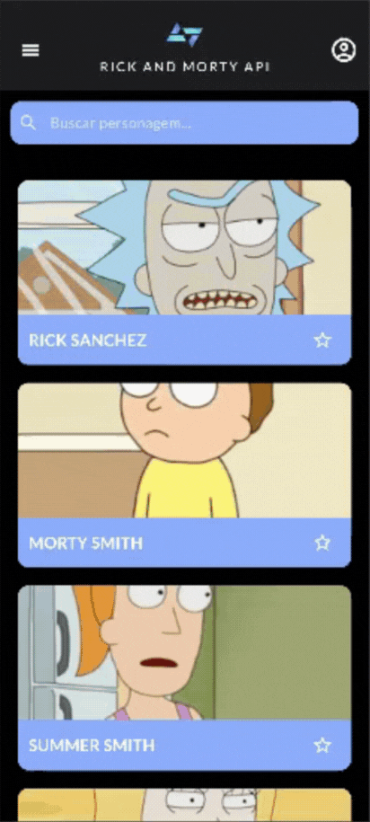
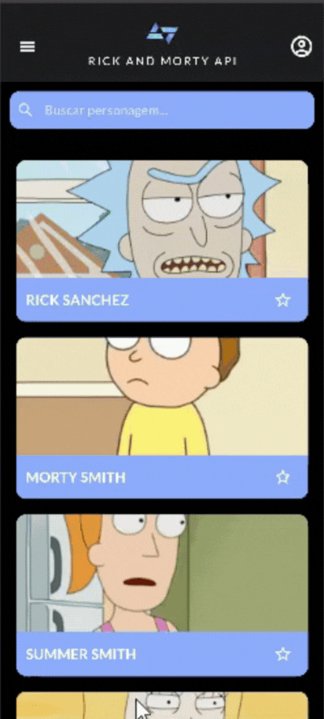
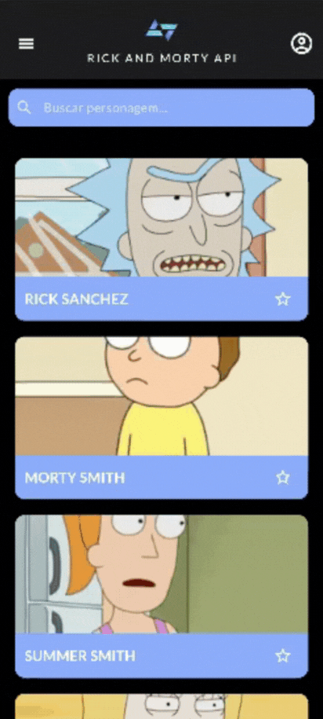
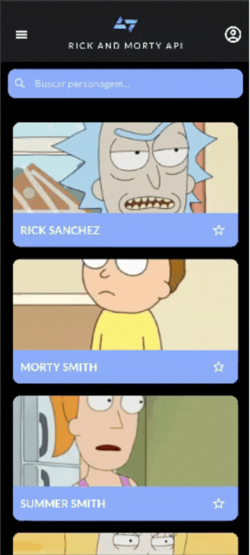
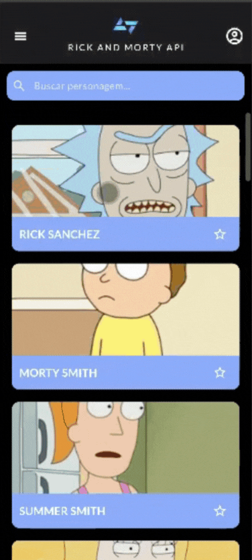

# Rick & Morty API Flutter App

Aplicativo desenvolvido em Flutter para o desafio técnico da edição 2025 do Kode Start.

## 📐 Padrões e Arquitetura

- **Arquitetura utilizada:**  
  - Estrutura baseada:
    - **`screens/`**: telas principais da aplicação.
    - **`components/`**: componentes comuns a todas as telas (AppBar e Drawer).
    - **`providers/`**: gerenciamento de estado com **Provider**.
    - **`models/`**: definição das classes de dados.
    - **`services/`**: configuração para uso do serviço da api.
    - **`theme/`**: gerenciamento de cores, imagens e temas.

- **Padrões adotados:**
  - **Provider Pattern** para gerenciamento de estado reativo.
  - **Uso de constantes e temas** centralizados (`AppColors`) para consistência visual.

- **🛠 Tecnologias Utilizadas**
   - Flutter — Framework de desenvolvimento multiplataforma.
   - Provider — Gerenciamento de estado.
   - Cached Network Image — Cache de imagens da internet.
   - Google Fonts — Fontes personalizadas.
   - Rick and Morty API — Fonte de dados.
---

## 📱 Funcionalidades

### ✅ Obrigatórias (Requisitos de entrega)

1. **Listagem de personagens**  
   - Exibe personagens da API Rick and Morty em cards com imagens e nomes.
   - Scroll na lista de personagens.    
   

2. **Tela de detalhes do personagem**  
   - Navegabilidade da tela de listagem até a tela de detalhes do personagem.
   - Exibe informações detalhadas: nome, status, espécie, gênero, localização, etc.  
   **Demonstração:**  
   

3. **Utilização da versão REST da API**

---

### 💡  Opcionais (Extras desenvolvidos)

4. **Pesquisa de personagens**  
   - Campo de busca integrado com o `SearchProvider`.
   - Filtragem instantânea conforme o usuário digita.
   

5. **Favoritar personagens**  
   - Marcar/desmarcar personagens como favoritos.
   - Tela exclusiva para favoritos.
   - Conexão entre as telas (o que é marcado/desmarcado em uma é exibido na outra)  
   **Demonstração:**  
   

6. **Tema Claro/Escuro**  
   - Alternância de tema persistida no app.  
   **Demonstração:**  
   

---

## 🚀 Como rodar o projeto

1. **Clonar repositório**
   ```bash
   git clone https://github.com/SEU_USUARIO/rickmorty.git
   cd rickmorty

2. **Instalar dependências**
   ```bash
   flutter pub get

3. **Rodar**
   ```bash
   flutter run